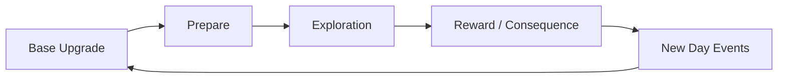

# [ชื่อเกม] — Core Loop & Gameplay

## Core Loop

## Core Mechanics

1. Base Upgrading - อัปฐานเพื่อให้ได้ผลประโยชน์ต่างๆเพิ่มขึ้น
2. Preparation - เตรียมอุปกรณ์ก่อนไปสำรวจ
3. Exploration - ผู้เล่นเลือกจุดที่จะสำรวจและแต่ละที่จะมีความพิเศษต่างกัน
4. Events - มีอีเว้นต่างๆเมื่อเริ่มวันใหม่และแต่ละทางเลือกส่งผลต่อทรัพยากรหรือฉากจบ
5. Hope - ความหวังในการเอาชีวิตของคนในฐาน เมื่อหมดจะเป็นการ game over

## Controls

| Key        | Action |
| ---------- | ------ |
| Left Click | Choose |
| Esc        | Menu   |

## Win / Lose Condition

- **ชนะเมื่อ:** เอาชีวิตรอดครบ 7 วัน
- **แพ้เมื่อ:** ไม่สามารถอาศัยในบ้านได้อีก (อาหารหมด/โดนโจมตี)
