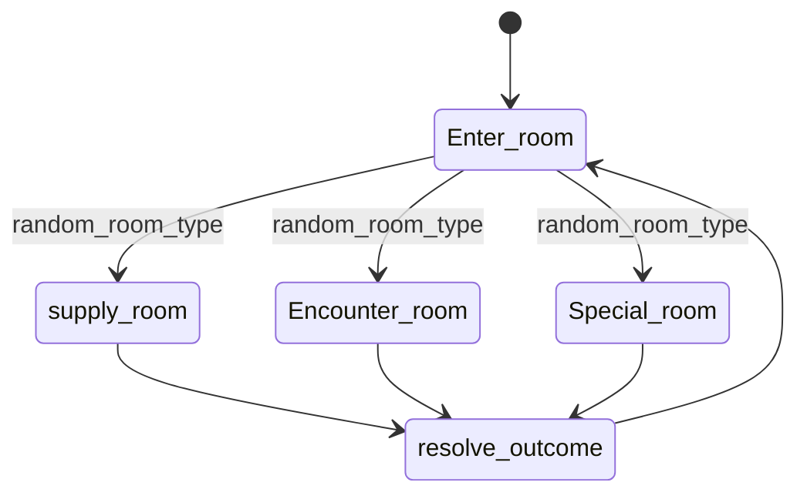

# Mechanic Design — [Exploration]

## State Diagram

## Rules

| State       | เข้าเงื่อนไข          | ออกเงื่อนไข            | Note               |
| ----------- | --------------------------------- | --------------------------------- | ------------------ |
| Enter room  | เข้าไปในห้องใหม่  | random ห้องแล้ว           |                    |
| Supply room | กดปุ่มทิศทาง          | ปล่อยปุ่ม / กระโดด | Speed = [ค่า]   |
| Jump        | กด Space ขณะอยู่พื้น | ถึงจุดสูงสุด          | Gravity = [ค่า] |
